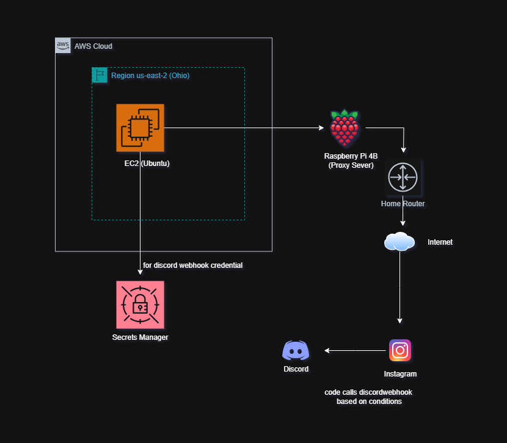

# aws-selenium-security-automation

## To Do:

CURRENT ISSUE: not sure why start.sh being run by terraform wont load the script to the instance.

ALSO VERY INTERESTING DEVELOPMENT: when i use a more powerful VM i don't get restricted by services???

- unrelated topic, but might as well use the pi as a pihole and block reddit traffic from a specific ip
**questions**:
- [ ] can you programmatically load secrets into the secrets manager
- [ ] specify the specific prileges to be added for the iam user for accessing the secrets manager in vncserver.md
- [ ] create an option for users to either set up the Secrets Manager, or hardcode the webhook in their code
- [ ] how does having a requirements.txt allow you to install a lot of packages at once - what are the specific instructions to run this file such that this occurs
- [ ] insert sob emoji for mandatory-manual.md file's title
- [ ] wait is python auto installed in ec2 instaces, dont remember ever separately installing it, if so, just make a note of it somewhere just to show that you're aware
- [ ] also make sure to mention that this tutorial is using ubuntu - see if there is any real difference in the instructions for between ubuntu and aws linux
- [ ] BUT, BEFORE THAT: ensure it being possible by recreating in AWS Linux (both manually and programmatically)
- [ ] is there a difference between the setup of aws cli between via programmatic access vs manual
- just for practice using gpg keys to install aws cli
- [ ] thoughts on getting a case for the pi and cooling stuff to have it always running - for the pi hole and the proxy

6.19 was working on the privacy browser, sue me

6.20 worked on the bigger picture of the project and identifying scope creeps

- [ ] remember to secure proxy server 😩
- [x] Actually implement the Security Manager into the code
- [ ] Actually implement **cloud security tools** into the project
    - [ ] AWS CloudTrail, Azure Security Center
- Work on the docs files
    - [x] finish (mullvad) gpg by today
- Look more into the security aspect (eg. restrict ssh ips)
- set up pi proxy asap - try to get whole project complete this week
- for best practice, note that the python script should use venvs to separate packages
- maybe include a page for random security notes, like in trying to use a vpn i somewhat learned about pgp keys (like at least how to use mullvad's pgp keys)
    - so the task would be to: flesh out knowledge and create a docs for it
    - another topic could be: vncserver
- get help from online communities for diagram improvement
- learn terraform and aws alternative (cloud formation) to try to spin up vms from code - is it possible to even load python scripts into these instances via these IaC

## Project Purpose
To provide a discrete and customizable method to recieve Instagram notifications via Discord.

## Project Overview:
Run a Selenium script on an Ubuntu EC2 instance which I interact with via GUI thru RealVNC Viewer and which connects to my Raspberry Pi 4B proxy server in order to continuously monitor the Instagram DMs page and call my Discord webhook when I receive a new DM.

## Architecture & Security Design

### Security Considerations:
1. AWS Secrets Manager
2. 

## Technologies
- AWS EC2 (Ubuntu) (or AWS Linux???)
- Selenium WebDriver
- RealVNC Viewer
- Raspberry Pi 4B
- Discord Webhooks
- Python

## Setup Instructions

### Manual Provisioning:
1. **EC2 Instance Setup**
Include steps here:

If you would rather provision your instance via IaC tools, here are their respective steps:
- [Provisioning via AWS CloudFormation](docs/aws_cloudformation.md)
- [Provisioning via Terraform](docs/terraform.md)

### Raspberry Pi Proxy Setup
Follow the [Raspberry Pi proxy guide](docs/raspberry-pi-proxy.md)

## Future Security Enhancements