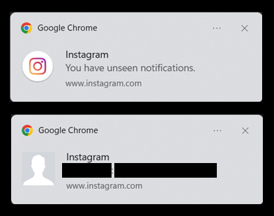
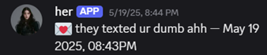

# instagram-to-discord-notifier

## Project Purpose
To provide a discrete and customizable method to receive desktop Instagram notifications via Discord.

Let's say you didn't want to get these pesky Instagram notifications:

But you STILL want to know when someone DMs you.

With this project you can: 
1. Get a notification of that notification via a familiar (read: better) interface: Discord
2. And you are able to customize the notification of that notification you get

Here's an example of what the customized notifications could look like:

## Project Overview:
This project runs a stealthy, headless Instagram monitor inside a Docker container that checks for new DMs and notifies a private Discord server via webhook — without relying on mobile notifications or app tracking.

Using a cookie-authenticated, headless Chrome session powered by undetected-chromedriver, the bot detects new messages by monitoring changes in the Instagram inbox tab title. When a DM is received, the container immediately sends a custom Discord alert.

_New approach:_ Fully headless browser automation inside a Docker container, cloud-deployable, cookie-based login
_Old approach (still included for reference):_ GUI-based Chrome on EC2, accessed via RealVNC, routed through a Raspberry Pi proxy

## Project Evolution:
| Version | Key Tech Stack | Description |
|--------|----------------|-------------|
| v0 (Ancient) | EC2, RealVNC, Secrets Manager, **RaspberryPi** | GUI-based bot hosted on EC2, accessed via VNC **and routed through a home proxy** |
| v1 (Legacy) | EC2, RealVNC, Secrets Manager | GUI-based bot hosted on EC2, accessed via VNC|
| v2 (Current) | Docker, Headless Chrome, Discord Webhooks | Containerized, cloud-portable version using headless Chrome and runtime secrets |

See [/docs-aws/README.md](/docs-aws/README.md) for the original GUI-based EC2 setup.

## Architecture & Security Design

### Security Considerations:
1. AWS Secrets Manager
2. Limited IAM User permissions
    - for accessing AWS Secrets Manager

## Technologies Used
- AWS EC2 (Ubuntu) ~~(or AWS Linux???)~~
- AWS Secrets Manager
- AWS Identity and Access Management (IAM)
- AWS CLI
- Python (Selenium)
- RealVNC Viewer
- Discord (Webhooks)

## Setup Instructions

1. Manual Provisioning: Follow the [docs/readme.md](docs/README.md) file for detailed instructions.

Currently, doing this project via IaC tools is on hold due to scope creep.

## Future Security Enhancements
