# Creating IAM User

### Overview

## Step-by-Step Instructions:

1. Assuming you're at the AWS Management Console, click on / search for "IAM". Here's what it'd look like if you were to click on it:

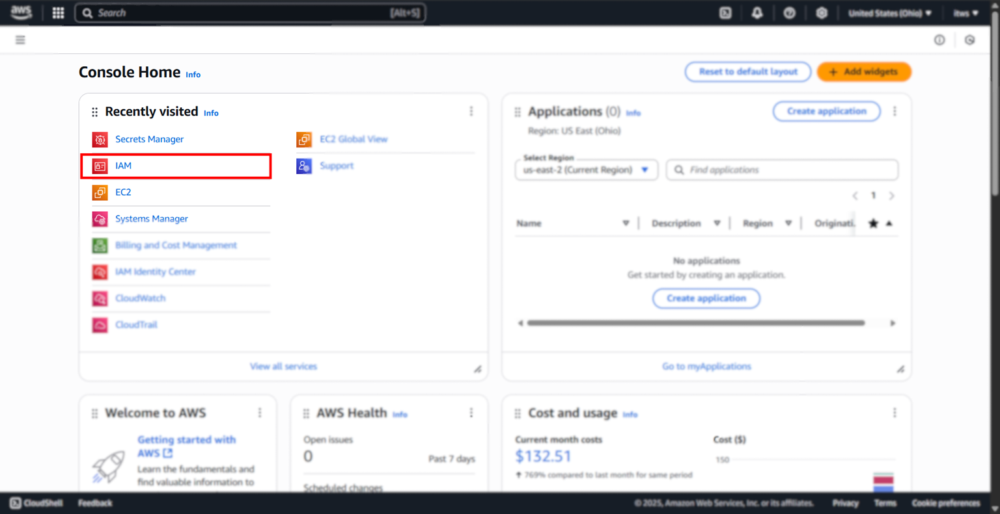

2. Now, you should be at the Identity and Access Management (IAM) dashboard. Find the IAM Resources block, which should be in the center of the IAM Dashboard, and locate "Users". Click on the number below it.

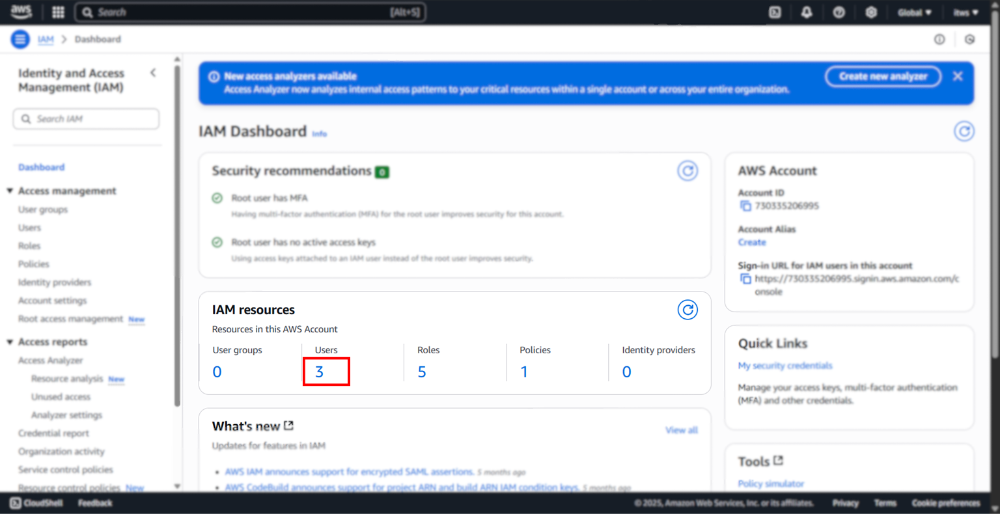

3. Now you should see a list of IAM users that exist on your account. Click the "Create user" button at the top right to create a new user.

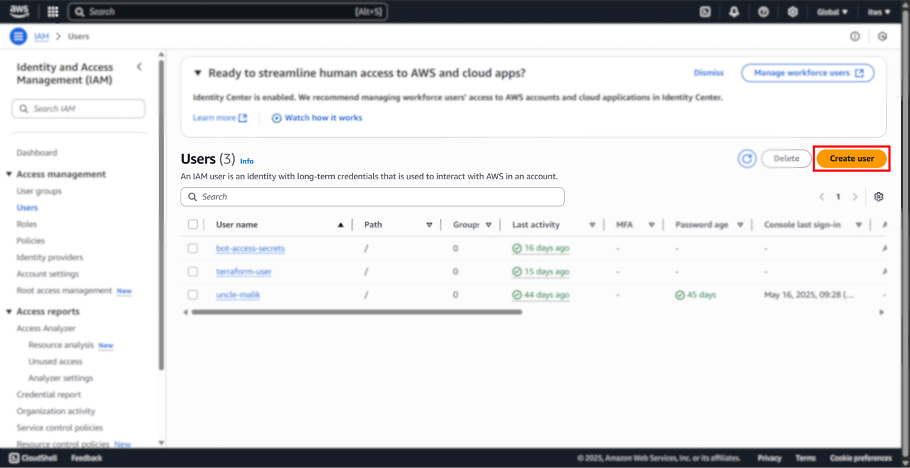

4. Give your IAM user a name.

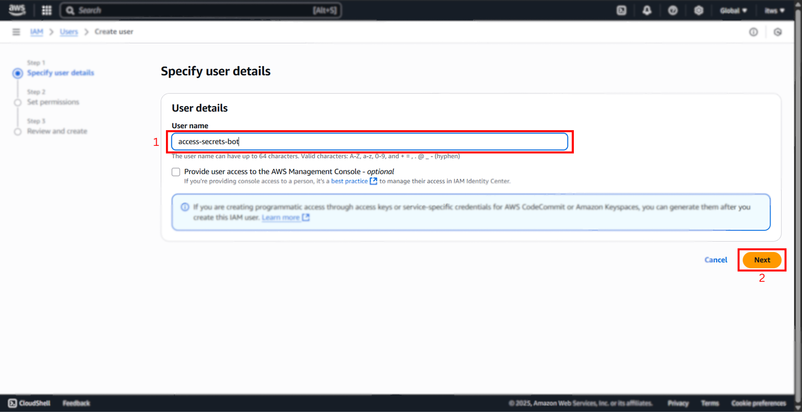

Then click "Next" at the bottom right.

5. Now, we're on the settings page. First, click on the "attach policies directly" option. 

Then, search for "secret" in the "Permissions policies" search bar.

Once "SecretsManagerReadWrite" option is visible, check that option ON.

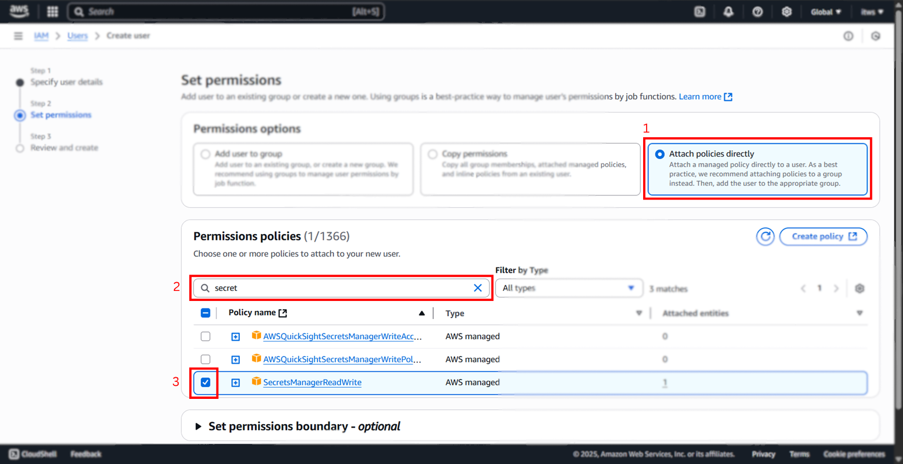

Scroll down and click "Next".

6. Finally, you're at the review page, do a cursory glace at this page to make sure everything looks right.

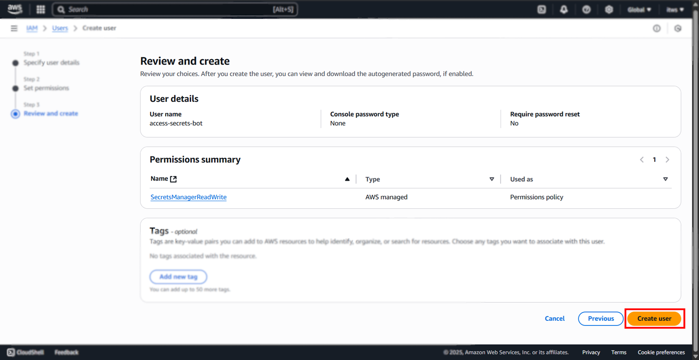

Click "Create user".

7. After the loading screen finished, you should be back at IAM's home. And you should see your user as part of the Users list.

If you look at my list in the image below, you can see the User at the top of the list of Users.

Click on it.

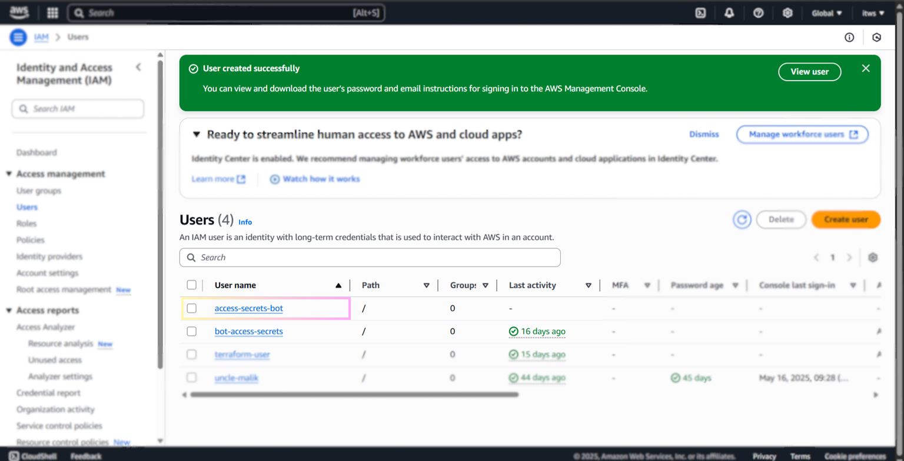

8. Now, we need to create an access key so that our code, via AWS CLI, can access the Secret.

Click on the top right, which says "Create access key".

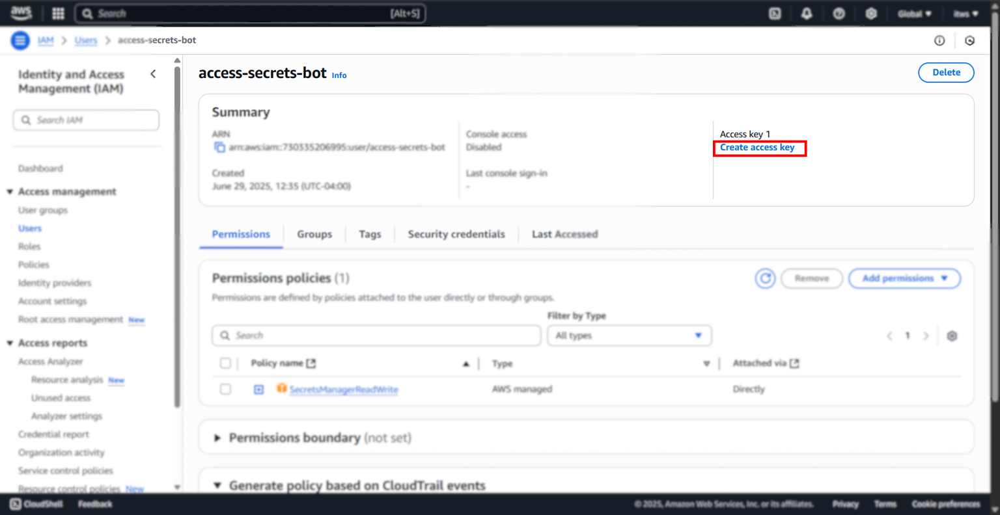

9. Here, we specify that we intent to use this key via the CLI, so select that option.

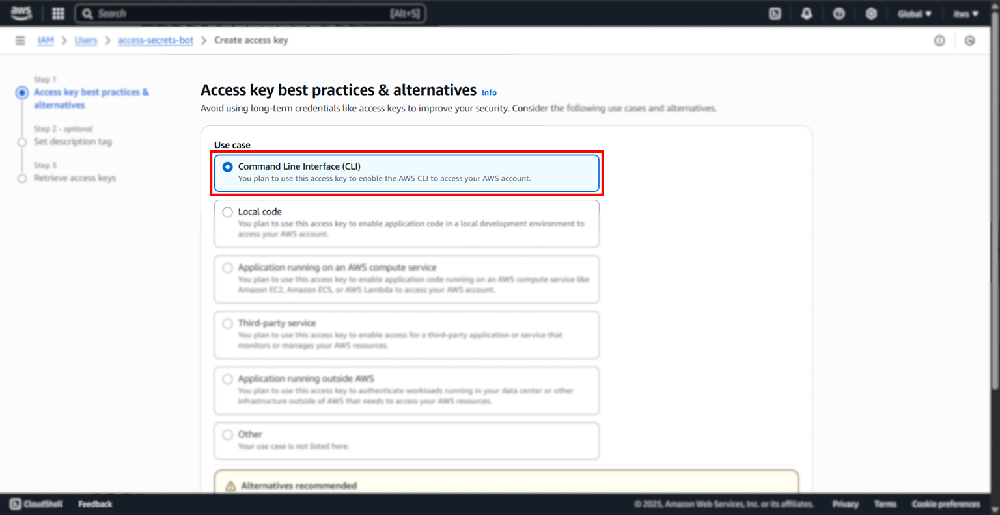

10. Scroll down, click the check box under "Confirmation", and click "Next".

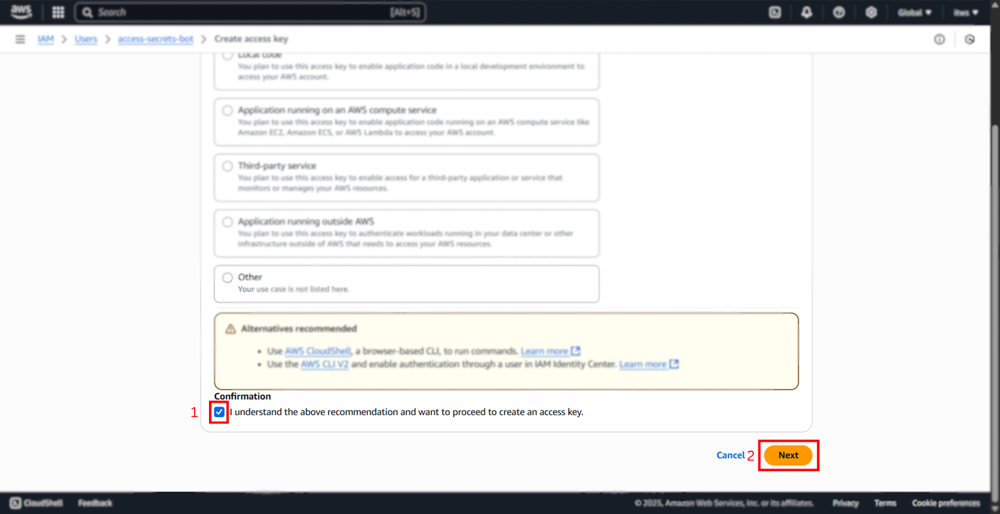

11. You may add a description tag value to this User if you so wish.

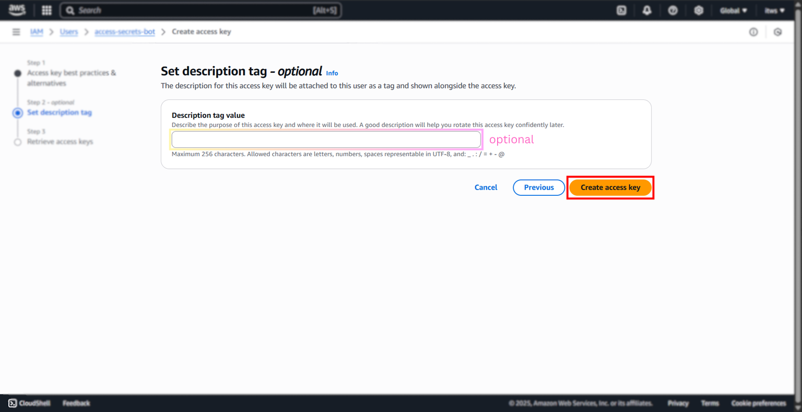

Click "Create access key".

12. 