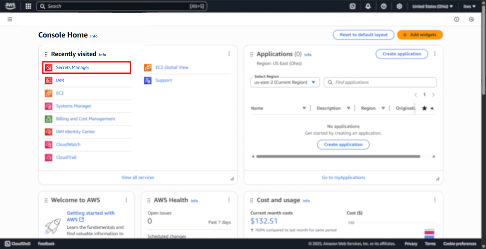
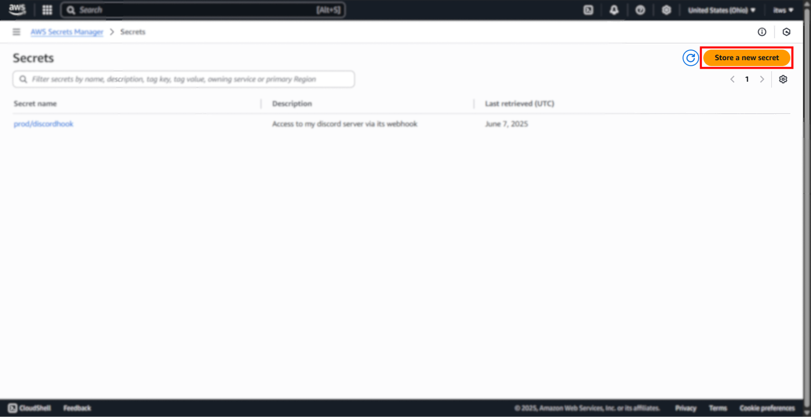
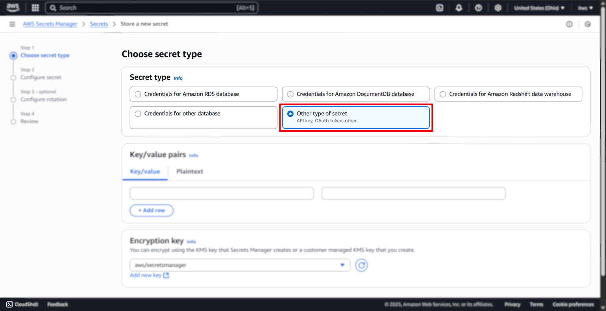
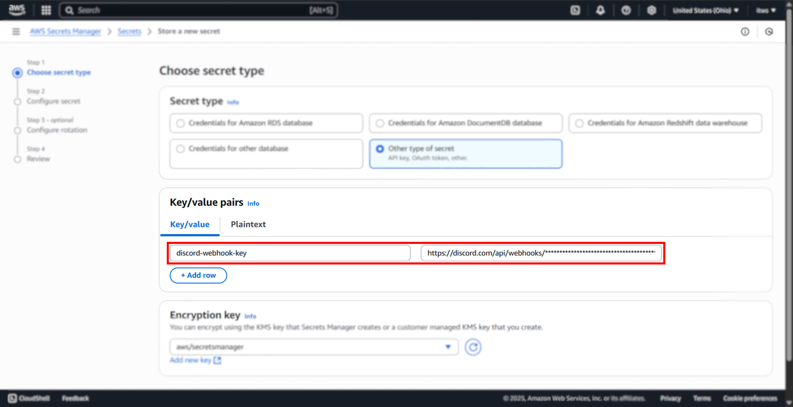
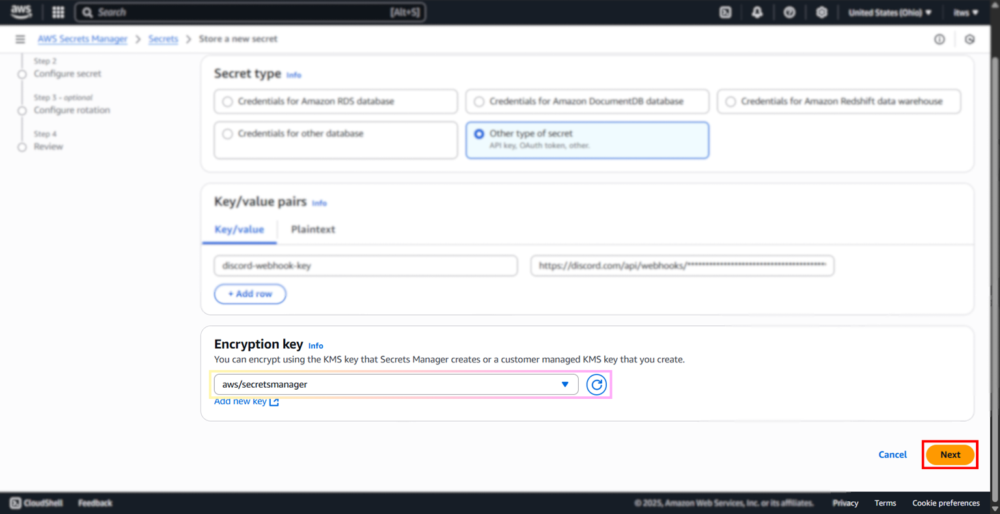
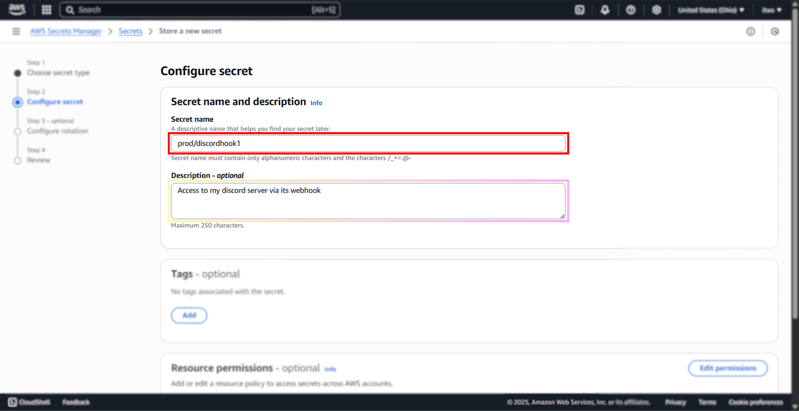
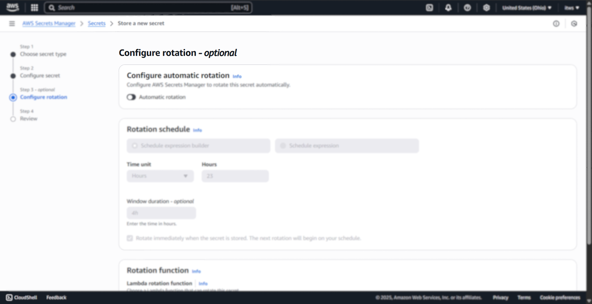
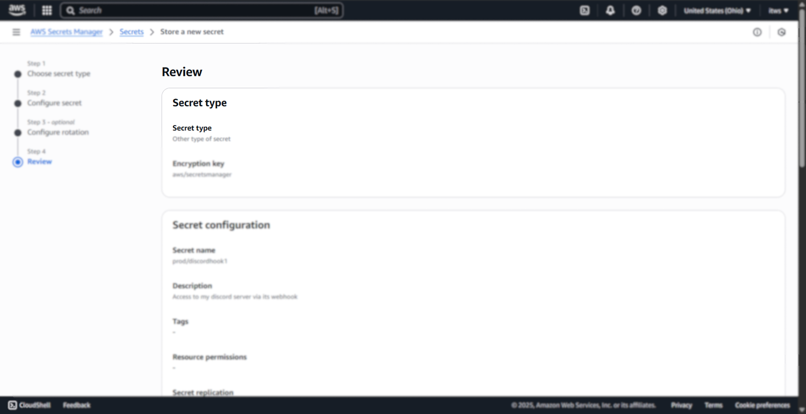
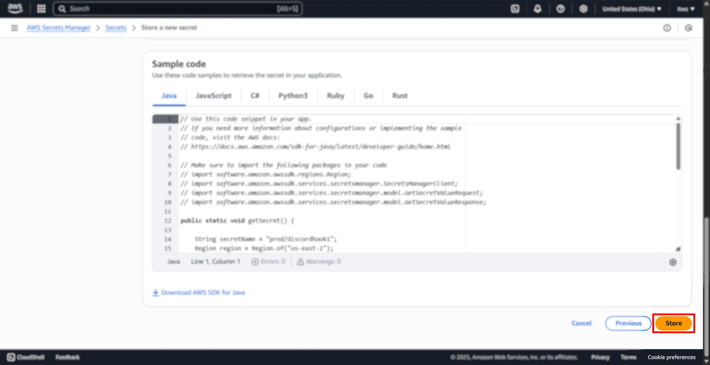
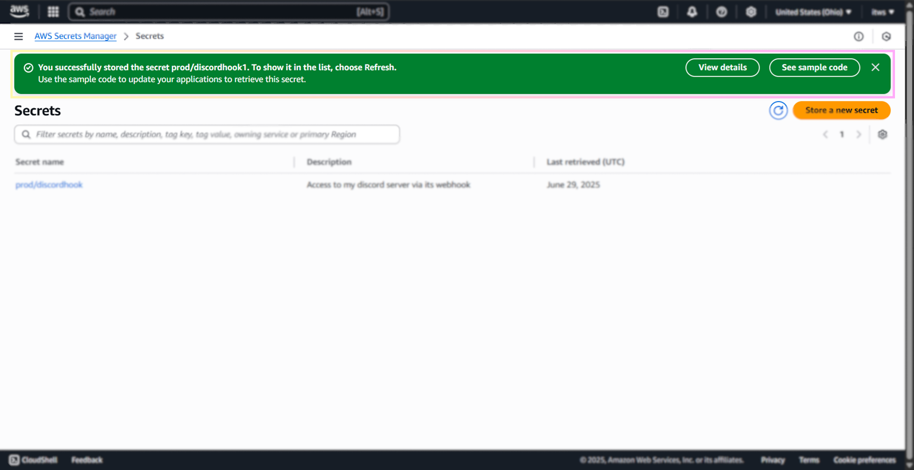

# Uploading to Secrets Manager

### Overview

## Step-by-Step Instructions:

1. First navigate to [https://console.aws.amazon.com/](https://console.aws.amazon.com/) and sign in.

Your view should look something like this:

2. Now navigate to Secrets Manager.

Use this [link](https://us-east-2.console.aws.amazon.com/secretsmanager/listsecrets) if you're unable to.

Click on "Store a new secret" at the top right of the page.

3. Before we store our secret, we need to choose what type it is, and for this project it will be: "Other type of secret"

4. Now we get to store our secret - our Discord webhook.

5. Leave the encryption key as defualt - `aws/secretsmanager`. Then click "Next".

6. Choose a memorable secrets name - I've chosen `prod/discordhook1`

You may also enter a description for this secret - I've chosen the following: "Access to my discord server via its webhook". It's quite short, but it does provide an accurate description of what is held there - a discord webhook which allows api access to a channel in my discord server.

7. This page ("Configure rotation") should be unnecessary for our simple use case. 

> Well I mean technically I could set this up right. Like assuming my assumption of how it works is correct (non-automatic rotation schedule just gives you alerts to rotate it every so days, and after a certain amount of days, it automatically disables the current secret), I COULD enable it.

Scroll down to the bottom & skip it:

8. This is the review page, review the information you've entered / configured:

9. Finally, click "Store" to store your secret.

10. Now you should be re-directed to your list of Secrets page. Click on the "View Details" button on the green header at the top of the page to view said details of your recently stored secret.

